
**IEEE I06 ASSIGNMENT 02 -DQN**

**Deep Q-Networks: A Practical Assignment**

**Assignment Tasks**

**Task 1: Environment Setup**

**Python Code:**

class Environment():

`    `#initalizing class with inital position and making grid

`    `def \_\_init\_\_(self):

`        `self.pos = (0, 0)

`        `self.grid = np.zeros((5, 5), dtype=int)

`        `self.obs = set()

`    `#function to reset grid and add obstacles

`    `def reset(self):

`        `self.grid = np.zeros((5, 5), dtype=int)

`        `self.pos = (0, 0)

`        `self.obs = set()

`        `self.obs.add((1,2))

`        `self.obs.add((2,2))

`        `self.obs.add((3,4))

`        `self.obs.add((1,0))

`        `self.obs.add((1,3))

`        `for obs in self.obs:

`            `self.grid[obs] = -1

`        `self.grid[0, 0] = 1

`        `self.grid[4, 4] = 2

`    `#function to move agent given an input action

`    `def step(self, action):

`        `y, x = self.pos

`        `if action == 0 and y > 0:

`            `newpos = (y - 1, x)

`        `elif action == 1 and y < 4:

`            `newpos = (y + 1, x)

`        `elif action == 2 and x > 0:

`            `newpos = (y, x - 1)

`        `elif action == 3 and x < 4:

`            `newpos = (y, x + 1)

`        `else:

`            `newpos = (y, x)

`        `if self.grid[newpos] == -1:

`            `return self.pos, -10, False

`        `self.pos = newpos

`        `reward = -1

`        `terminated = False

`        `if self.pos == (4,4):

`            `reward = 10

`            `terminated = True

`        `return self.pos, reward, terminated

`    `#function to render the grid

`    `def render(self):

`        `grid = self.grid.copy()

`        `grid[self.pos] = 3

`        `print(grid)

**Task 2: Implement DQN**

**Python code:**

class ReplayMem():

`    `#initializing class

`    `def \_\_init\_\_(self, maxlen):

`        `self.memory = deque([], maxlen=maxlen)

`    `#function to append data to buffer

`    `def append(self, transition):

`        `self.memory.append(transition)

`    `#function for sampling minibatches from buffer

`    `def sample(self, sample\_size):

`        `return random.sample(self.memory, sample\_size)

`    `def \_\_len\_\_(self):

`        `return len(self.memory)

class Agent():

`    `#initializing class

`    `def \_\_init\_\_(self, alpha, gamma):

`        `self.alpha = alpha

`        `self.gamma = gamma

`        `self.epsilon = 1.0

`        `self.loss\_fn = nn.MSELoss()

`        `self.optimizer = None

`        `self.actions = ['U', 'D', 'L', 'R']

`    `#function that returns one out of 4 possible actions

`    `def sample(self):

`        `return random.randint(0, 3)

`    `#function to convert int input to tensor

`    `def convert(self, posi):

`        `inp = torch.zeros(25)  # 5x5 grid = 25 states

`        `inp[posi] = 1

`        `return inp

`    `#function to convert index input to tensor

`    `def converter(self, posi):

`        `x, y = posi

`        `inp = torch.zeros(25)  # 5x5 grid = 25 states

`        `inp[5 \* x + y] = 1

`        `return inp

`    `#function to train agent

`    `def train(self, episodes):

`        `#set epsilon to 1 and declare memory buffer

`        `self.epsilon = 1

`        `memory = ReplayMem(maxlen=4000)

`        `# Define policy and target networks

`        `policy\_DQN = nn.Sequential(

`            `nn.Linear(25, 32),

`            `nn.ReLU(),

`            `nn.Linear(32, 32),

`            `nn.ReLU(),

`            `nn.Linear(32,10),

`            `nn.ReLU(),

`            `nn.Linear(10 , 4)

`        `)

`        `target\_DQN = nn.Sequential(

`            `nn.Linear(25, 32),

`            `nn.ReLU(),

`            `nn.Linear(32, 32),

`            `nn.ReLU(),

`            `nn.Linear(32,10),

`            `nn.ReLU(),

`            `nn.Linear(10 , 4)

`        `)

`        `#copy policy network onto target network

`        `target\_DQN.load\_state\_dict(policy\_DQN.state\_dict())

`        `#declare optimizer and print policy

`        `self.optimizer = torch.optim.Adam(policy\_DQN.parameters(), lr=self.alpha)

`        `self.print\_dqn(policy\_DQN)

`        `#declaring arrays for rewards and epsilon history

`        `rewards\_per\_episode = np.zeros(episodes)

`        `epsilon\_hist = []

`        `#episode loop

`        `for i in range(episodes):

`            `#reset variables

`            `env.reset()

`            `terminated = False

`            `total\_reward = 0

`            `step\_count = 0

`            `#while loop to navigate through grid

`            `while not terminated and step\_count<1000:

`                `step\_count+=1

`                `#taking actions according to epsilon greedy policy

`                `if random.random() < self.epsilon:

`                    `action = self.sample()

`                `else:

`                    `with torch.no\_grad():

`                        `action = policy\_DQN(self.converter(env.pos)).argmax().item()

`                `#taking step and storing data in memory buffer

`                `init\_state = env.pos

`                `new\_state, reward, terminated = env.step(action)

`                `total\_reward += reward

`                `memory.append((init\_state, action, new\_state, reward, terminated))

`            `rewards\_per\_episode[i] = (total\_reward)

`            `#optimizing neural network in minibatches of size 64

`            `if len(memory) > 64:

`                `mini\_batch = memory.sample(64)

`                `self.optimize(mini\_batch, policy\_DQN, target\_DQN,i)

`                `if  i%100==0:

`                    `self.print\_dqn(policy\_DQN)

`            `# Decay epsilon

`                `self.epsilon = max(self.epsilon \*0.9975, 0.1)

`                `epsilon\_hist.append(self.epsilon)

`            `# Update target network

`                `target\_DQN.load\_state\_dict(policy\_DQN.state\_dict())

`        `# Save the trained model

`        `torch.save(policy\_DQN.state\_dict(), "grid.pt")

`        `# Plot results

`        `plt.figure(figsize=(12, 6))

`        `plt.subplot(121)

`        `plt.plot(rewards\_per\_episode)

`        `plt.title("Rewards Per Episode")

`        `plt.xlabel("Episodes")

`        `plt.ylabel("Total Reward")

`        `plt.subplot(122)

`        `plt.plot(epsilon\_hist)

`        `plt.title("Epsilon Decay")

`        `plt.xlabel("Episodes")

`        `plt.ylabel("Epsilon")

`        `plt.show()

`    `def test(self, episodes):

`        `env.reset()

`        `policy\_DQN = nn.Sequential(

`            `nn.Linear(25, 32),

`            `nn.ReLU(),

`            `nn.Linear(32, 32),

`            `nn.ReLU(),

`            `nn.Linear(32, 10),

`            `nn.ReLU(),

`            `nn.Linear(10 , 4)

`        `)

`        `#loading trained model

`        `policy\_DQN.load\_state\_dict(torch.load("grid.pt"))

`        `policy\_DQN.eval()

`        `print('Policy (trained):')

`        `self.print\_dqn(policy\_DQN)

`        `#simulate episodes

`        `for i in range(episodes):

`            `env.reset()

`            `terminated = False

`            `step = 0

`            `#taking actions according to trained policy

`            `while not terminated and step<200:

`                `step +=1

`                `init\_state = env.pos

`                `with torch.no\_grad():

`                    `action = policy\_DQN(self.converter(env.pos)).argmax().item()

`                `new\_state , reward, terminated = env.step(action=action)

`                `env.render()

`    `#function to optimize neural net

`    `def optimize(self, mini\_batch, policy\_DQN, target\_DQN, i):

`        `current\_q\_list = []

`        `target\_q\_list = []

`        `#loops through minibatch

`        `for init\_state, action, pos, reward, terminated in mini\_batch:

`            `#updates target according to bellman equation with alpha set to 1

`            `if terminated:

`                `target = torch.FloatTensor([reward])

`            `else:

`                `with torch.no\_grad():

`                    `target = torch.FloatTensor((reward + self.gamma \* target\_DQN(self.converter(pos)).max()))

`            `#storing q values of policy and target network

`            `current\_q = policy\_DQN(self.converter(init\_state))

`            `current\_q\_list.append(current\_q)

`            `target\_q = target\_DQN(self.converter(init\_state))

`            `target\_q[action] = target

`            `target\_q\_list.append(target\_q)

`        `#calculating loss

`        `loss = self.loss\_fn(torch.stack(current\_q\_list), torch.stack(target\_q\_list))

`        `#optimizing the network

`        `self.optimizer.zero\_grad()

`        `loss.backward()

`        `self.optimizer.step()

`    `#function to print policy 

`    `def print\_dqn(self, dqn):

`        `# Get number of input nodes

`        `num\_states = 25

`        `# Loop each state and print policy to console

`        `for s in range(num\_states):

`            `#  Format q values for printing

`            `q\_values = ''

`            `for q in dqn(self.convert(s)).tolist():

`                `q\_values += "{:+.2f}".format(q)+' '  # Concatenate q values, format to 2 decimals

`            `q\_values=q\_values.rstrip()              # Remove space at the end

`            `# Map the best action to L D R U

`            `best\_action = self.actions[dqn(self.convert(s)).argmax()]

`            `# Print policy in the format of: state, action, q values

`            `# The printed layout matches the FrozenLake map.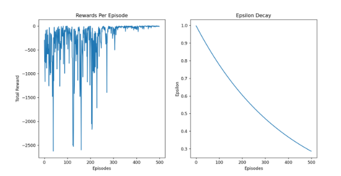

`            `print(f'{s:02},{best\_action},[{q\_values}]', end=' ')         

`            `if (s+1)%5==0:

`                `print() # Print a newline every 4 states

**The above plots show the total rewards in each episode as well as the epsilon decay during training**

**Task 3: Analyze Performance**

After training the model for a few different obstacle placements(10) we can see that the model generally is successful in learning the optimal policy

Ex:

For the given grid, the rewards per episode vs episode graph is shown.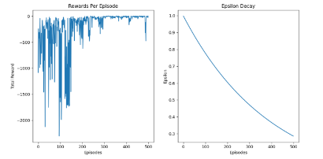

![ref1]

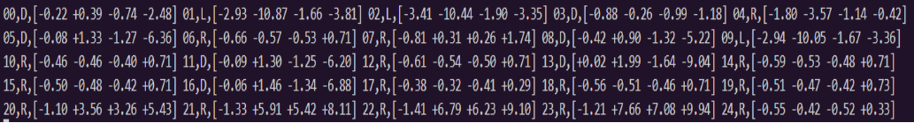

**The policy learned by the agent. The letters symbolize the optimal step that can be taken in each state**

If we use the policy to traverse the grid we see that the agent always reaches in the end in minimum number of steps ensuring 100% success rate. But the caveat is that the agent fails to learn to optimal policy in some cases(some initial states of the network cause the agent to be unable to find the optimal policy)

**Visualization:**

![ref2]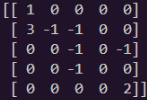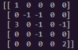

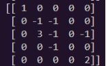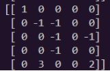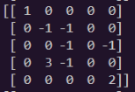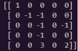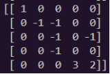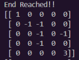![ref3]![ref4]![ref4]![ref3]![ref3]

**0s represent free space, 1 is the start, 2 is the end and 3 represents the current position of the agent.**

**Out of 10 different obstacle placements, the agent was able to learn the optimal policy 5 times on the first training session. Which gives us a 50% success rate. (Although this is not accurate as the sample space is too small)** 

**Some Important Observations:**

- The agent showed greatly increased efficiency when the learning rate of the optimizer was changed from 0.001 to 0.01.
- The agent needed more steps before termination as it couldn’t find the goal in most cases and just settled for not colliding with obstacles.
- The size of the replay memory buffer needs to be sufficiently large.
- Using a learning rate scheduler might be necessary as the model needs high learning rate at the start to learn the policy but might need to fine tune it later
- Using a specialized initializer might help with the cases where the agent isn’t able to find the optimal policy.
- Using exponential decay instead of linear decay of epsilon helped to improve the model.

[ref1]: Aspose.Words.48d7d94e-33b4-472a-9dcd-b1270da0db60.003.png
[ref2]: Aspose.Words.48d7d94e-33b4-472a-9dcd-b1270da0db60.005.png
[ref3]: Aspose.Words.48d7d94e-33b4-472a-9dcd-b1270da0db60.014.png
[ref4]: Aspose.Words.48d7d94e-33b4-472a-9dcd-b1270da0db60.016.png
